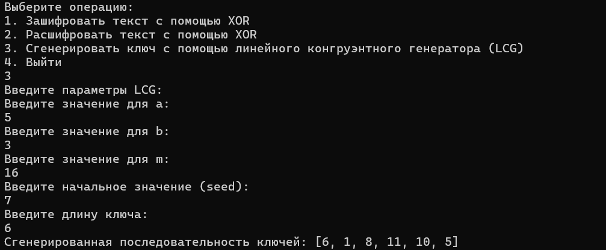

---
# Front matter
lang: ru-RU
title: "Лабораторная работа №3"
subtitle: "Дисциплина: Математические основы защиты информации и информационной безопасности"
author: "Алгайли Абдулазиз Мохаммед"

# Formatting
toc-title: "Содержание"
toc: true # Table of contents
toc_depth: 2
lof: true # Список рисунков
lot: true # Список таблиц
fontsize: 12pt
linestretch: 1.5
papersize: a4paper
documentclass: scrreprt
polyglossia-lang: russian
polyglossia-otherlangs: english
mainfont: PT Serif
romanfont: PT Serif
sansfont: PT Sans
monofont: PT Mono
mainfontoptions: Ligatures=TeX
romanfontoptions: Ligatures=TeX
sansfontoptions: Ligatures=TeX,Scale=MatchLowercase
monofontoptions: Scale=MatchLowercase
indent: true
pdf-engine: lualatex
header-includes:
  - \linepenalty=10
  - \interlinepenalty=0
  - \hyphenpenalty=50
  - \exhyphenpenalty=50
  - \binoppenalty=700
  - \relpenalty=500
  - \clubpenalty=150
  - \widowpenalty=150
  - \displaywidowpenalty=50
  - \brokenpenalty=100
  - \predisplaypenalty=10000
  - \postdisplaypenalty=0
  - \floatingpenalty = 20000
  - \raggedbottom
  - \usepackage{float}
  - \floatplacement{figure}{H}
---

# Цель работы

Познакомиться с шифрованием с помощью XOR и генерацией ключей с использованием линейного конгруэнтного генератора (LCG).

# Задание

1. Программно реализовать шифрование с помощью XOR.
2. Программно реализовать расшифровку с помощью XOR.
3. Программно реализовать генерацию ключей с использованием линейного конгруэнтного генератора (LCG).

# Выполнение лабораторной работы

1) Все шифрования были реализованы на языке Julia. Сначала я создал функцию `xor_encrypt`, которая реализует побитовое сложение (XOR) между символами текста и ключа. Для расшифровки текста используется та же функция, так как операция XOR обратима.

### Реализация функции шифрования XOR

```julia
function xor_encrypt(plaintext::String, key::String)
    if length(key) < length(plaintext)
        error("Key must be as long as or longer than the plaintext.")
    end

    encrypted = [Char(codepoint(plaintext[i]) ⊻ codepoint(key[i])) for i in 1:length(plaintext)]
    return join(encrypted)
end
```

### Тестирование шифрования и расшифровки

#### Шаг 1: Шифрование

**Пример 1:**

```plaintext
Текст для шифрования: Привет
Ключ для шифрования: Ключик
```

```plaintext
Зашифрованный текст: {vu
```


#### Шаг 2: Расшифровка

**Пример 2:**

```plaintext
Зашифрованный текст: {vu
Ключ для расшифровки: Ключик
```

```plaintext
Расшифрованный текст: Привет
```


2) Далее я реализовал генерацию ключей с использованием линейного конгруэнтного генератора (LCG). Для этого была создана функция `lcg`, которая генерирует последовательность псевдослучайных чисел на основе параметров a, b, m и seed.

### Реализация LCG

```julia
function lcg(a, b, m, seed, length)
    random_sequence = Int[]
    yi = seed
    for i in 1:length
        yi = (a * yi + b) % m
        push!(random_sequence, yi)
    end
    return random_sequence
end
```

### Тестирование генерации ключей

**Пример 3:**

```plaintext
Параметры LCG: a = 5, b = 3, m = 16, seed = 7, длина = 6
Сгенерированная последовательность: [6, 1, 8, 11, 10, 5]
```



5) Для удобства пользователя был создан интерактивный интерфейс с меню, позволяющим выбрать операцию: шифрование, расшифровка или генерация ключа.

# Выводы

Я успешно реализовал шифрование с использованием XOR и генерацию ключей с помощью линейного конгруэнтного генератора (LCG). Все функции были протестированы на примерах с использованием русского текста. Результаты тестов показали, что шифрование и расшифровка работают корректно, а генерация ключей выдает ожидаемые результаты.
